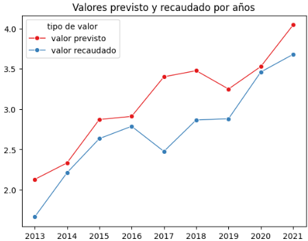

# Análisis exploratorio sobre datos de ingresos públicos de Brasil del 2013 al 2021.


Este proyecto consiste en la realización de un análisis exploratorio de datos (EDA) sobre un conjunto de datos de ingresos gubernamentales de Brasil que contiene información por diferentes categorías económicas, organizaciones y años. El objetivo principal es identificar patrones de ingresos, su evolución a lo largo del tiempo y las discrepancias entre los valores previstos y recaudados.

## Objetivos del Proyecto

Los objetivos principales del análisis son:

1. **Limpieza de datos**: Se parte de nueve archivos de `csv` distintos que habrá que homogeneizar y hacer un primer limpiado para concatenarlos y generar el archivo principal sobre el cual trabajaremos.

2. **Análisis Exploratorio de Datos (EDA)**: Examinar la relación entre diferentes variables clave y explorar categorías relevantes para identificar patrones o discrepancias significativas.

3. **Visualización**: Generar gráficos que permitan identificar tendencias y patrones relevantes en los datos analizados.


## Resumen del proyecto

- En el primer fichero el principal objetivo fue el renombramiento de las columnas, formatear datos como fechas y float, eliminar duplicatos y concatenar las tablas para generar una única tabla de trabajo llamada `tablas_concatenadas.csv`.

- El siguiente paso fue una limpieza en profundidad de los valores nulos. En este momento nos dimos cuenta de que los datos sobre los que ibamos a trabajar, que son valor previsto, registrado y recaudado, presentaban una gran cantidad de nulos y valores a 0. En este punto se tuvieron que tomar decisiones de como se debían gestionar para el futuro análisis.

- El análisis se centró en tres puntos principales: distribución de ingresos por categoría económica, evaluación de las tendencias a lo largo del tiempo e identificación de discrepancias.

- Finalmente en la parte de visualización se pueden encontrar gráficas de la comparación entre ingresos previstos, lanzados y realizados para cada categoría, la evolución temporal de los ingresos realizados y previstos y la dispersión de las diferencias entre los valores previstos y realizados en diferentes categorías.

## Conclusiones 

- El primer aspecto a mencionar es sin duda alguna la dificultad que ha habido para trabajar con los datos, ya que gran parte de las columnas de los valores eran nulos o 0, por lo que habría sido interesante hablar con las entidades brasileñas e intentar obtener unos datos más completos.

- Continuando con las conclusiones obtenidas tenemos que hay dos categorías económicas principales de las que provienen de cada una casi el 50% de la recaudación y estas son `Receitas Correntes` y `Receitas de Capital`. Para cada categoría económica también hemos observado la diferencia entre el valor recaudado y el previsto, arrojando un valor negativo para las dos principales categorías anteriormente mencionadas. La media obtenida por categorías de la diferencia es de medio billón perdido entre lo estimado y lo recaudado, lo que comienza a darnos un indicativo de que el valor previsto calculado es un poco irrealista y uno de los primeros pasos a ejecutar sería ver qué está fallando en esta previsión e intentar solucionarlo.

- En cuanto al análisis temporal hemos observado que por lo general ha ido en aumento a lo largo de los años, sin embargo, el valor registrado siempre es mucho menor que el recaudado, lo que indica una clara necesidad de mejora en la gestión a la hora de registrar el valor. Ya que si el valor recaudado es 4 o 5 veces mayor que el registrado habría que investigar con mayor profundidad qué está pasando con ese dinero, ya que estamos hablando de 1 o 2 billones al año. De nuevo parece que el valor previsto es siempre mayor que el recaudado reforzando nuestra idea anterior de que es necesaria una revisión del calculo de este valor para poder aproximarnos más a la realidad.

- También se llevó a cabo un análisis por meses, obervando que en los tres primero años solo hay registros del mes de diciembre. En los años posteriores se observa que en la mayor parte de los casos hay solo un valor previsto en enero y alguno menor en otro mes del año lo que parece indicar que se hace una previsión a un año y luego igual un mes hacen una pequeña modificación. Esto habría que corroborarlo con el gobierno Brasileño y sugerir hacer ajustes cada mes intentando alcanzar así un valor más realista para el valor previsto.

- Finalmente mediante visualizaciones podemos observar la dispersión por categorías entre el valor recaudado y el registrado. Como habíamos observado anteriormente podemos ver la gran cantidad de outlayers negativos que presentan las dos principales categorías. Entendiendo así visualmente que la previsión al ser mucho mayor que la recaudación es la que genera estos puntos, siendo este un gran problema en el que habría que focalizarse por solucionar. 

    También se puede ver de una forma mucho más clara como el valor previsto es todos los años superior al valor recaudado, reforzando de nuevo la necesidad de observar qué está pasando con este valor previsto y por qué se aleja tanto del recaudado entre 2017 y 2019.



## Propuestas de mejora

1. **Mejora en la Calidad y Completitud de los Datos**: Debido a la gran cantidad de valores nulos y ceros en datos críticos, se recomienda trabajar con las instituciones financieras de Brasil para obtener datos más completos y precisos. Es necesario implementar mejores mecanismos de recolección de información financiera a lo largo del ciclo de ingresos, asegurando que las entidades involucradas reporten datos más detallados y exactos.

2. **Mejora en el Proceso de Registro de Ingresos**: El desfase entre el valor registrado y el valor recaudado sugiere problemas de gestión. Es necesario implementar un sistema centralizado y automatizado que registre los ingresos de manera más precisa y en tiempo real, reduciendo discrepancias que podrían indicar irregularidades.

3. **Revisión de la Metodología de Previsión de Ingresos**: La significativa diferencia negativa entre los valores previstos y recaudados, especialmente en las categorías principales como Receitas Correntes y Receitas de Capital, indica que los métodos actuales de cálculo del valor previsto no reflejan con precisión la realidad. Se recomienda realizar una auditoría de los modelos de previsión para identificar las causas de las discrepancias.

4. **Monitoreo y Ajustes Mensuales en las Previsiones**: Actualmente, las previsiones parecen ajustarse una vez al año. Se recomienda establecer un monitoreo mensual de ingresos, ajustando las previsiones de acuerdo con las realidades económicas del país, lo que permitiría una planificación más precisa y flexible.

## Estructura del Proyecto

El proyecto está organizado de la siguiente manera:

- **datos/**: Carpeta que contiene los archivos `.csv` y cualquier otro tipo de dato necesario.

- **notebooks/**: Carpeta que contiene los archivos `.ipynb` sobre los cuales hemos trabajado los datos en el siguiente orden:
  - `1-exploracion_inicial.ipynb`
  - `2-limpieza.ipynb`
  - `3-eda.ipynb`
  - `4-visualizacion.ipynb`

- **src/**: Carpeta que contiene los archivos `.py` externos usados para definir las funciones que se llaman desde los notebooks.
  - `soporte_limpieza.py`


## Instalación y Requisitos
Este proyecto usa Python 3.11 y requiere las siguientes bibliotecas:
- numpy
- pandas
- matplotlib.pyplot
- seaborn
- re

Para visualizar el proyecto en tu máquina local, sigue estos pasos:

1. **Clona el repositorio**:
   ```bash
   git clone [URL del repositorio]
   
2. **Navega a la carpeta del proyecto**:
   ```bash
   cd Proyecto2-EDA-Ingresos-Publicos-Brasil/notebooks

2. **Ejecutar los archivos**:
   Deberás ejecutar cada notebook en el orden definido para poder ir viendo la evolución del estudio.